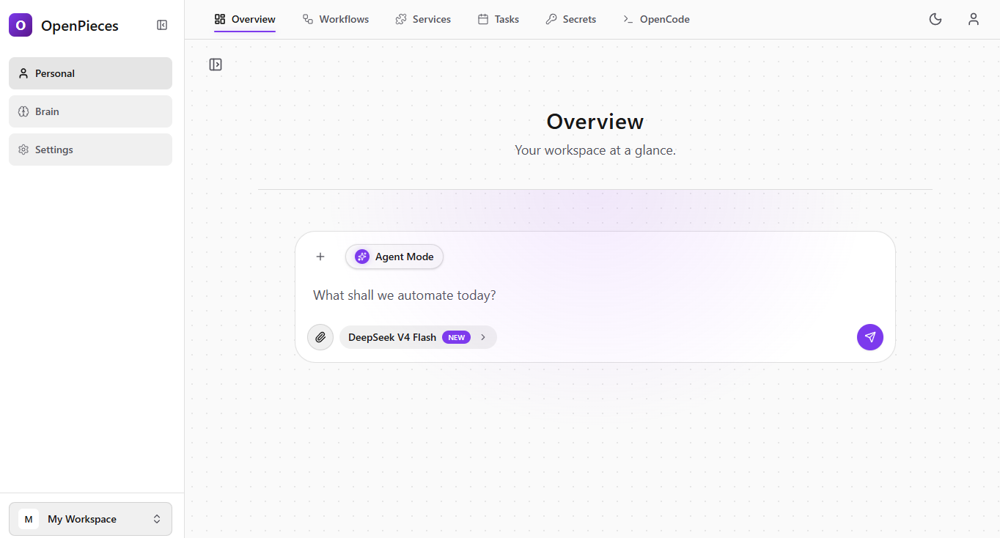

# OpenPieces



OpenPieces is an intelligent personal assistant that dynamically creates, deploys, and manages tools — called *pieces* — on the fly. When it encounters a task it can't handle with its existing toolkit, it autonomously builds a new piece to fill the gap, deploys it instantly, and retains it for future use. Over time, OpenPieces grows a continuously expanding ecosystem of capabilities, adapting to your needs without manual intervention.

---


## Quick Start

```bash
cp .env.example .env
# Fill in the required values in .env — see Environment Variables below
docker compose up -d --build
```

Open [http://localhost:3141](http://localhost:3141) and go to `/setup`.

---

## Prerequisites

- [Docker](https://docs.docker.com/get-docker/) ≥ 24
- [Docker Compose](https://docs.docker.com/compose/install/) v2

---

## Production Deploy

### 1. Clone and configure

```bash
git clone <your-repo>
cd openpieces
cp .env.example .env
```

Edit `.env` — at minimum you need to set:
- `AUTH_SECRET` — session signing key
- `SECRETS_ENCRYPTION_KEY` — encryption key
- `INTERNAL_API_KEY` — internal service auth
- `OPENCODE_SERVER_PASSWORD` — OpenCode server password
- `POSTGRES_PASSWORD` — database password
- `AI_GATEWAY_API_KEY` — for all AI routing via Vercel Gateway

Generate a secret: `node -e "console.log(require('crypto').randomBytes(32).toString('base64'))"`

### 2. Launch

```bash
docker compose up -d --build
```

This starts all services with health checks and restart policies:
- **app** — Next.js standalone server
- **worker** — background job processor (AI tasks, brain reinforcement)
- **db** — PostgreSQL 16 with pgvector (bundled)
- **opencode** — AI coding assistant

### 3. Access

Go to `http://localhost:3141/setup` to create your admin account.

---

## Development

For local development with hot reload:

```bash
docker compose -f docker-compose.dev.yml up --build
```

- App → [http://localhost:3141](http://localhost:3141)
- OpenCode → `localhost:4096`

**Rebuild after dependency changes:**
```bash
docker compose -f docker-compose.dev.yml up --build
```

**Clean slate:**
```bash
docker compose -f docker-compose.dev.yml down -v
```

---

## Managing

**Tail logs:**
```bash
docker compose logs --tail=50 -f
```

**Restart a service:**
```bash
docker compose restart app
```

**Update to latest:**
```bash
docker compose up -d --build
```

**Stop everything:**
```bash
docker compose down
```

**Wipe database and start fresh:**
```bash
docker compose down -v
```

---

## Using an External Database

By default a PostgreSQL container is started automatically. To use your own (Supabase, Neon, Railway, etc.):

1. Set `DATABASE_URL` in `.env` to your connection string
2. Remove the `db` service from `docker-compose.yml`

The bundled Postgres includes `pgvector` for embedding storage — your external DB will need it too.

---

## Environment Variables

### Required for production

| Variable | Description |
|---|---|
| `AUTH_SECRET` | Auth.js session signing key. Generate with `node -e "console.log(require('crypto').randomBytes(32).toString('base64'))"` |
| `SECRETS_ENCRYPTION_KEY` | Encryption key for stored secrets. Generate with the command above. |
| `INTERNAL_API_KEY` | Key used by OpenCode to authenticate against the internal API. Generate with the command above. |
| `OPENCODE_SERVER_PASSWORD` | Password for the OpenCode server. |
| `POSTGRES_PASSWORD` | Password for the bundled PostgreSQL database. |
| `AI_GATEWAY_API_KEY` | Vercel AI Gateway key required to route global AI model calls. |

### Optional

| Variable | Default | Description |
|---|---|---|
| `APP_PORT` | `3141` | Internal port for the Next.js app (exposed to host) |
| `OPENCODE_PORT` | `4096` | Internal port for the OpenCode server |
| `NEXT_PUBLIC_APP_URL` | `http://localhost:3141` | Public URL — change to your domain in production |
| `TAVILY_API_KEY` | — | Tavily web search API key |
| `DB_POOL_MAX` | `5` | Connection pool size for the app |
| `PG_BOSS_POOL_SIZE` | `5` | Connection pool size for the worker |
| `PG_BOSS_CONCURRENCY` | `10` | Max concurrent background jobs |

---

## Tech Stack

- **[Next.js 16](https://nextjs.org)** — App Router, React Server Components
- **[React 19](https://react.dev)** — concurrent features
- **[Tailwind CSS v4](https://tailwindcss.com)** — styling
- **[Xyflow](https://xyflow.com)** — workflow canvas
- **[Motion](https://motion.dev)** — animations
- **[PostgreSQL 16](https://www.postgresql.org)** + **[pgvector](https://github.com/pgvector/pgvector)** — database and embeddings
